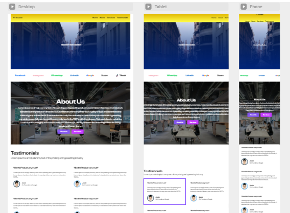

# 🎯 Framer Learning Journey — 0 to Client-Ready in 2 Months

> Learning Framer from scratch under senior mentorship — building real, published websites every week with a goal to work with clients by the end of Month 2.

[](https://www.linkedin.com/in/saqlain-ahmad/)
[](https://framer.com)


---

## 🙋 About This Repo

This repository documents my complete 2-month Framer learning journey — from absolute beginner to client-ready developer. Every week I build a real project, push my progress here, and document what I learn daily.

I am learning under the guidance of a senior developer who gives me a 1-hour lecture daily, followed by hands-on practice. This repo is my proof of work — every commit, every note, every project.

**Goal:** Be ready to build websites for real clients by the end of Month 2.

---

## 📅 Weekly Progress

| Week | Focus | What I Built | Live Link | Status |
|------|-------|-------------|-----------|--------|
| Week 1 | Framer canvas, layers, typography | Static portfolio shell | — | 🔄 In Progress |
| Week 2 | Page structure, spacing, nav | First published page | — | ⏳ Upcoming |
| Week 3 | Components & variants | Reusable UI component set | — | ⏳ Upcoming |
| Week 4 | Interactions & animations | Interactive landing page | — | ⏳ Upcoming |
| Week 5 | Real-world cloning | Site clone project | — | ⏳ Upcoming |
| Week 6 | Full business website | Business site (niche TBD) | — | ⏳ Upcoming |
| Week 7 | SEO, performance, polish | Polished & optimized site | — | ⏳ Upcoming |
| Week 8 | Final client-ready project | Full client-style website | — | ⏳ Upcoming |

> ✅ Done &nbsp;&nbsp; 🔄 In Progress &nbsp;&nbsp; ⏳ Upcoming

---

## 🖼️ Project Previews

<!-- Add your screenshots here as you build each week -->
<!-- HOW TO ADD: upload image to the repo, then use the format below -->

### Week 1 — Coming Soon
> Screenshot will be added at end of week

<!--
HOW TO ADD A SCREENSHOT LATER:

-->

---

## 📁 Repo Structure

```
framer-learning-journey/
│
├── week-01/          → Week 1 project files, notes & Framer URL
├── week-02/          → Week 2 project files, notes & Framer URL
├── ...
├── week-08/          → Final client-ready project
├── resources/        → Useful links, tools & references
├── LEARNINGS.md      → Daily learning notes (3 bullets every day)
└── README.md         → You are here
```

---

## 🧠 Daily Learning Log

I write 3 bullet points every single day in [`LEARNINGS.md`](./LEARNINGS.md):
- What I learned
- What confused me
- What I want to explore next

No zero days. Every day gets a commit.

---

## 🛠️ Tools I'm Using

| Tool | Purpose |
|------|---------|
| [Framer](https://framer.com) | Designing and publishing websites |
| [GitHub](https://github.com) | Documenting progress and version control |
| [VS Code](https://code.visualstudio.com) | Writing custom code overrides in Framer |
| [LinkedIn](https://linkedin.com) | Sharing progress with the professional community |

---

## 📬 Connect With Me

I'll be sharing updates on LinkedIn starting Week 5 once I have real work to show.

[](https://www.linkedin.com/in/saqlain-ahmad)

---

## 📌 Roadmap at a Glance

```
Month 1 — Learn & Build
  Week 1–2 → Foundations (canvas, typography, first page)
  Week 3–4 → Interactions, components, CMS basics

Month 2 — Real Projects & Polish
  Week 5–6 → Full business websites, real-world clones
  Week 7   → SEO, performance, accessibility
  Week 8   → Final project + LinkedIn showcase → Client ready 🚀
```

---

<p align="center">
  <i>Building in public. One commit at a time.</i><br/>
  <b>Started:</b> 15/05/2026 &nbsp;|&nbsp; <b>Target:</b> 15/07/2026
</p>
